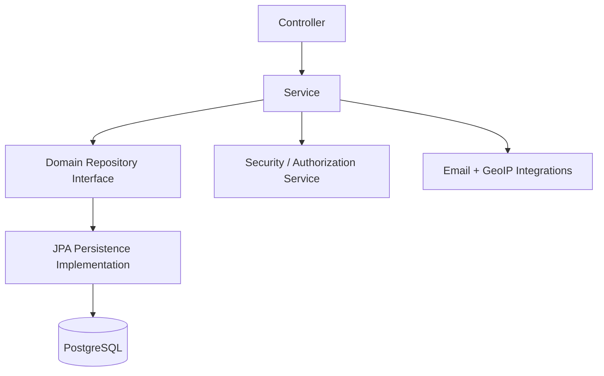

# Library API (Spring Boot)

A production-style Spring Boot REST API for managing users, authors, books, and loans, with:

- cookie-based signed token authentication
- session tracking and revocation
- role and account state checks through MVC interceptors
- email verification and optional 2FA (OTP by email)
- consistent error responses
- validation and test coverage (unit + integration)

> Java 21, Spring Boot 3.2.x, PostgreSQL, Maven

---

## Features

- **User management**
  - create account
  - update profile
  - change password
  - admin can toggle `isActive` / `isAdmin`
- **Authentication & sessions**
  - signed token in `HttpOnly` cookie
  - session persisted in database
  - logout = logical session revocation (`isActive=false`)
  - list/revoke own sessions, admin can list/revoke all
- **Security model per user (1:1)**
  - exactly one security record per user
  - email verification status
  - 2FA enabled/disabled
  - OTP hash + expiration
- **Email verification flow**
  - verification token is generated (raw token sent by email, hash stored)
  - `/verify-email.html` calls API to verify
  - supports "already verified" response
- **2FA flow**
  - if 2FA is enabled: login does not immediately return auth cookie
  - API returns `OTP_REQUIRED` + temporary challenge cookie
  - auth cookie is returned only after OTP verification
- **Domain entities**
  - `Author` CRUD (admin writes, authenticated reads)
  - `Book` CRUD (admin writes, authenticated reads)
  - `Laon` (loan) without delete; owner/admin authorization rules
- **Logical delete**
  - author/book deletion is logical (`isDeleted`) to avoid FK issues
- **Error handling**
  - centralized exception handler
  - standardized JSON error payload
  - strict unknown-field JSON behavior

---

## Tech Stack

- **Runtime**: Java 21
- **Framework**: Spring Boot 3.2.2
- **Persistence**: Spring Data JPA + PostgreSQL
- **Validation**: Jakarta Validation
- **Crypto**: BCrypt + HMAC SHA-256 token signing
- **Mail**:
  - Gmail SMTP OAuth2 mode
  - SMTP username/password fallback mode
- **Tests**: JUnit 5, Mockito, Spring MockMvc/WebMvcTest

---

## Project Structure

```text
src/main/java/com/example/app/
  controllers/      # REST controllers
  services/         # business logic
  repositories/     # domain repository interfaces
  infrastructure/
    entities/       # JPA entities
    persistences/   # JPA repository implementations
  mappers/          # domain <-> entity mapping
  security/         # annotations + interceptors + auth helpers
  dtos/             # request/response contracts
  exceptions/       # unified API error handling
```

---

## Architecture

The code follows a layered architecture:

- **Controller layer**: HTTP contract + input validation
- **Service layer**: business logic + authorization orchestration
- **Repository layer**: domain persistence interfaces
- **Infrastructure layer**: JPA entities/repositories + external integrations (mail, GeoIP)
- **Security layer**: interceptors and route-level access annotations

### Diagram



---

## Configuration

The app loads `.env` automatically through:

```properties
spring.config.import=optional:file:.env[.properties]
```

Use `env.example` as your template.

### Minimum required variables

```env
# App
SERVER_PORT=8080

# Database
DB_HOST=localhost
DB_PORT=5432
DB_NAME=app_db
DB_USER=app_user
DB_PASSWORD=change_me

# Token/session/security
TOKEN_SECRET=change_me_to_a_long_random_secret
TOKEN_EXPIRATION_SECONDS=86400
TOKEN_CHALLENGE_EXPIRATION_SECONDS=300
SESSION_EXPIRATION_SECONDS=86400
SECURITY_EMAIL_VERIFICATION_EXPIRATION_SECONDS=86400
SECURITY_OTP_EXPIRATION_SECONDS=300

# Public URL used in email links
APP_PUBLIC_BASE_URL=http://localhost:8080
```

### Mail configuration

#### Option A - Gmail SMTP OAuth2 (recommended)

```env
GMAIL_CLIENT_ID=
GMAIL_CLIENT_SECRET=
GMAIL_REFRESH_TOKEN=
EMAIL_FROM=your_email@gmail.com
SMTP_HOST=smtp.gmail.com
SMTP_PORT=587
```

#### Option B - SMTP user/password

```env
SMTP_HOST=smtp.gmail.com
SMTP_PORT=587
SMTP_USER=your_email@gmail.com
SMTP_PASS=your_app_password
SMTP_FROM_EMAIL=your_email@gmail.com
```

Notes:

- `EMAIL_FROM` is preferred and can fall back to `SMTP_FROM_EMAIL` or `GMAIL_SENDER_EMAIL`.
- If neither OAuth2 nor SMTP credentials are complete, email send is skipped and logged.

---

## Run Locally

### 1) Start PostgreSQL

```bash
docker compose up -d
```

### 2) Run the API

```bash
mvn spring-boot:run
```

API default base URL:

```text
http://localhost:8080
```

### OpenAPI / Swagger

After startup:

- OpenAPI JSON: `http://localhost:8080/api-docs`
- Swagger UI: `http://localhost:8080/swagger-ui.html`

---

## Security Pipeline

Custom annotations:

- `@RequireAuthenticated`
- `@RequireActive`
- `@RequireAdmin`

Interceptors order:

1. `AuthenticationInterceptor`
2. `ActiveInterceptor`
3. `AdminInterceptor`

`ActiveInterceptor` checks:

- user account is active
- email is verified

---

## Authentication and Email/2FA Flows

### Register

1. `POST /users` creates user.
2. A `Security` record is created (1 per user).
3. Verification email is sent.

### Verify email

1. User opens link to `/verify-email.html?...`.
2. Page calls `PUT /users/verify-email/{id}` with token.
3. API sets `isMailVerified=true` (or returns already verified).

### Login (without 2FA)

1. `POST /users/login`
2. returns auth cookie `token`.

### Login (with 2FA)

1. `POST /users/login` returns `202` with:
   - payload code `OTP_REQUIRED`
   - cookie `login_challenge`
2. OTP is sent by email.
3. `POST /users/login/otp` with OTP:
   - returns auth cookie `token`
   - clears `login_challenge`.

### Logout

- `POST /users/logout` revokes current session (`isActive=false`) and clears auth cookie.

### 2FA sequence (quick visual)

```text
Client -> POST /users/login
API -> 202 + login_challenge cookie + OTP_REQUIRED
Client -> POST /users/login/otp (with OTP)
API -> 204 + token cookie + clear login_challenge
```

---

## API Endpoints (high-level)

### Users (`/users`)

- `POST /users` - create user
- `POST /users/login` - login
- `POST /users/login/otp` - complete 2FA login
- `PUT /users/verify-email/{id}` - verify email
- `POST /users/logout` - logout
- `GET /users/me` - current user
- `GET /users` - list users (admin)
- `GET /users?page=0&size=20` - paginated users list (admin)
- `PUT /users` - update user
- `PATCH /users/password/{id}` - change password
- `PATCH /users/active` - set active (admin)
- `PATCH /users/admin` - set admin (admin)
- `DELETE /users/{id}` - delete user (owner/admin rule in service)

### Security (`/security`)

- `GET /security/me` - current user security settings
- `PATCH /security/2fa` - enable/disable 2FA

### Sessions (`/sessions`)

- `GET /sessions/me` - own sessions
- `GET /sessions/me?page=0&size=20` - paginated own sessions
- `PATCH /sessions/{id}/revoke` - revoke one session (owner/admin)
- `GET /sessions` - all sessions (admin)
- `GET /sessions?page=0&size=20` - paginated all sessions (admin)

### Authors (`/authors`)

- `GET /authors` - authenticated + active
- `GET /authors?page=0&size=20` - paginated authors list
- `GET /authors/{id}` - authenticated + active
- `POST /authors` - admin + active
- `PUT /authors/{id}` - admin + active
- `DELETE /authors/{id}` - logical delete (admin + active)

### Books (`/books`)

- `GET /books` - authenticated + active
- `GET /books?page=0&size=20` - paginated books list
- `GET /books/{id}` - authenticated + active
- `POST /books` - admin + active
- `PUT /books/{id}` - admin + active
- `DELETE /books/{id}` - logical delete (admin + active)

### Loans (`/laons`)

- `POST /laons` - authenticated + active
- `GET /laons/me` - authenticated + active (owner scope)
- `GET /laons/me?page=0&size=20` - paginated own loans
- `GET /laons/{id}` - authenticated + active (owner/admin)
- `GET /laons` - admin + active
- `GET /laons?page=0&size=20` - paginated all loans (admin)
- `PATCH /laons/{id}/return` - authenticated + active (owner/admin)

---

## JSON Examples

Login request:

```json
{
  "email": "john@example.com",
  "password": "AmAm198905@"
}
```

2FA required response:

```json
{
  "code": "OTP_REQUIRED",
  "message": "OTP sent to your email"
}
```

Verify OTP request:

```json
{
  "otp": "123456"
}
```

Create book request:

```json
{
  "title": "Clean Architecture",
  "description": "A guide to software structure and design.",
  "authorId": "11111111-1111-1111-1111-111111111111"
}
```

---

## Error Response Format

All handled errors return a consistent JSON shape through `GlobalExceptionHandler`, including:

- `timestamp`
- `status`
- `error`
- `code`
- `message`
- `path`
- `details` (when relevant)

Examples of business codes:

- `EMAIL_NOT_VERIFIED`
- `OTP_REQUIRED`
- `OTP_INVALID`
- `ACCOUNT_INACTIVE`
- `FORBIDDEN_ADMIN`
- `VALIDATION_ERROR`

---

## Testing

Run full test suite:

```bash
mvn test
```

Includes:

- mapper tests
- repository tests
- service tests
- controller tests
- security interceptor tests
- integration-style MockMvc tests

---

## CI/CD

GitHub Actions workflow is included in `.github/workflows/ci.yml`:

- triggers on push and pull requests
- sets up Java 21
- runs `mvn clean verify`

---

## Docker

Production-style containerization files are included:

- `Dockerfile` (multi-stage build)
- `docker-compose.yml` (API + PostgreSQL + healthcheck)

Run with containers:

```bash
docker compose up --build -d
```

---

## Notes

- Some naming uses `Laon` in code and routes (`/laons`) for backward compatibility.
- Browser requests to `/favicon.ico` are handled as `404 RESOURCE_NOT_FOUND` if no icon is provided.

